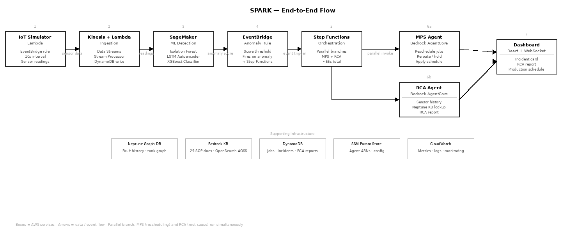
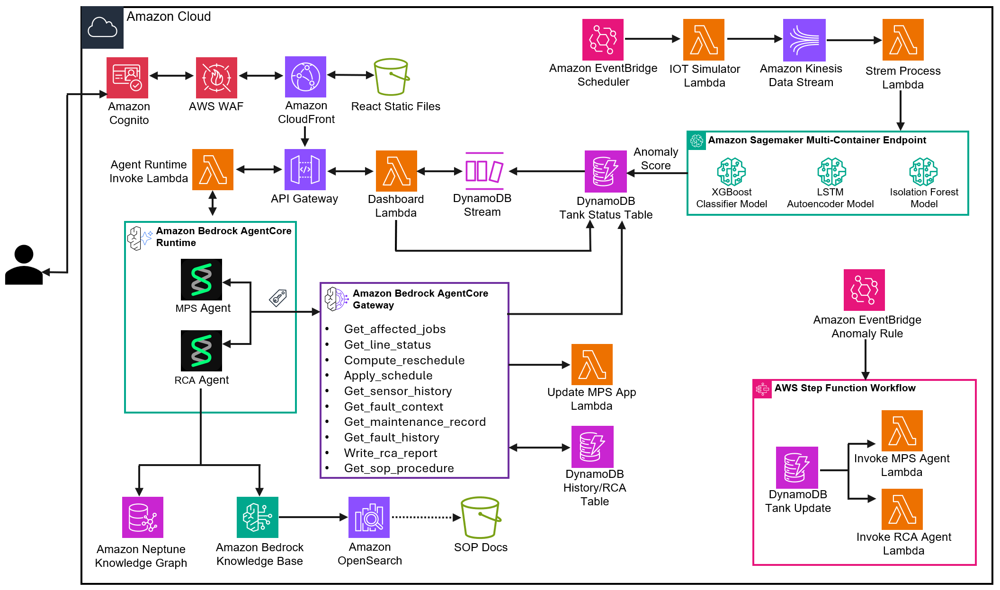

# SPARK — Smart Paint-shop Anomaly Response & Knowledge

Automotive paint-shop ML + IoT pipeline on AWS. Monitors 12 treatment tanks (8 pre-treatment, 4 e-coat) in real time, detects anomalies using three ML models, and autonomously reschedules production jobs or generates root-cause analysis reports via AI agents.

---

## Problem Statement

Automotive paint shops operate a sequence of chemical treatment tanks — pre-treatment, phosphating, and electro-deposition — where each vehicle body spends precise durations in controlled chemical baths. When a tank degrades (wrong pH, depleted zinc, temperature creep), the consequences are severe: paint adhesion failures, corrosion under the coat, or full strip-and-rework of completed bodies.

Today this is managed reactively. Plant engineers monitor dashboards manually, detect faults through visual inspection or end-of-line quality checks, and then spend hours manually rescheduling production jobs and writing root-cause reports. A single undetected fault can hold up an entire production line, scrapping hours of work-in-progress and delaying vehicle delivery.

**The core challenges:**
- Sensor anomalies are multivariate and time-dependent — a fault doesn't appear in one sensor reading but across correlated signals over time
- Manual rescheduling is slow and error-prone under pressure — engineers must know which jobs can be rerouted to equivalent tanks and which must be held
- Root-cause reports are written from memory hours after the event, losing diagnostic accuracy
- There is no closed-loop: detecting the fault, rescheduling production, and documenting the cause are three separate disconnected processes

---

## Solution

SPARK connects these three processes into a single autonomous pipeline. When sensors indicate a degrading tank, SPARK detects the fault in real time using an ensemble of three ML models, triggers an AI-driven workflow that simultaneously reschedules affected production jobs and generates a structured root-cause analysis report, and pushes the results to an operator dashboard — all within ~55 seconds of detection, with no manual intervention required.

### End-to-End Flow



1. **Fault detected** — IoT Simulator publishes sensor readings every 10 seconds; Stream Processor Lambda scores each reading against three ML models
2. **Anomaly confirmed** — combined score exceeds threshold; `tank-status` DynamoDB record flips to `degraded`
3. **Workflow triggered** — EventBridge anomaly rule fires; Step Functions starts parallel MPS + RCA branches
4. **MPS Agent** — retrieves affected jobs, computes reschedule using tank equivalence constraints, writes updated assignments to `production-jobs`
5. **RCA Agent** — queries Neptune knowledge graph, retrieves SOP from Bedrock Knowledge Base, writes structured report to `rca-reports`
6. **Dashboard update** — WebSocket push notifies React SPA; operator sees rescheduled jobs and full RCA report in real time

---

## Features

- **Real-time anomaly detection** — three-model ensemble (Isolation Forest + LSTM Autoencoder + XGBoost) running on a SageMaker Multi-Container Endpoint, scoring sensor readings as they arrive via Kinesis
- **Autonomous job rescheduling** — MPS Agent (Bedrock AgentCore + Strands) identifies affected production jobs and reroutes them to chemically equivalent tanks or holds them for inspection based on tank equivalence groups
- **AI-generated root-cause analysis** — RCA Agent queries a Neptune knowledge graph and 33 SOP documents in a Bedrock Knowledge Base to produce structured fault reports with severity, recurrence risk, and remediation steps
- **Live operator dashboard** — React SPA with WebSocket updates showing tank telemetry, incident cards, production schedule, and RCA reports; fault injection controls for demo/testing
- **Knowledge graph** — Neptune graph connecting tanks, fault types, causal chains, and SOP references for context-aware agent reasoning
- **9 fault classes detected** across pre-treatment (PT) and electro-deposition (ED) lines with per-class severity and production impact
- **Deterministic recurrence risk** — recurrence risk on each incident is computed from actual fault history in DynamoDB, not LLM judgment, ensuring consistency
- **Per-workflow cost attribution** — Bedrock Application Inference Profiles tag every Claude and Titan Embed invocation by workflow, component, and environment, making SPARK's AI costs visible and filterable in AWS Cost Explorer

  | Profile | Workflow Tag | Component Tag | Model |
  |---------|-------------|---------------|-------|
  | `spark-mps-agent` | `production-scheduling` | `mps-agent` | Claude Haiku 4.5 |
  | `spark-rca-agent` | `root-cause-analysis` | `rca-agent` | Claude Haiku 4.5 |
  | `spark-kb-embeddings` | `root-cause-analysis` | `kb-embeddings` | Titan Embed Text v2 |

  Start with a base filter in AWS Cost Explorer: **Service** = `Amazon Bedrock` · **Tag: Project** = `spark-paintshop-intelligence`

  | View | Group by | Filter by | What you get |
  |------|----------|-----------|--------------|
  | Cost by workflow | Tag: Capability | _(base only)_ | `production-scheduling` vs `root-cause-analysis` totals |
  | Total RCA cost (agent + KB) | Tag: Component | Tag: Capability = `root-cause-analysis` | `rca-agent` + `kb-embeddings` combined, with per-component split |
  | Dev vs prod split | Tag: Environment | _(base only)_ | Cost breakdown by environment |
  | All SPARK components | Tag: Component | _(base only)_ | Per-component breakdown across all workflows |

---

## Technical Components

| Layer | Services / Frameworks |
|-------|----------------------|
| **IaC** | AWS CDK (9 stacks) |
| **IoT Ingestion** | EventBridge Scheduler · Kinesis Data Streams · Lambda |
| **ML Detection** | SageMaker Multi-Container Endpoint — Isolation Forest (sklearn) · LSTM Autoencoder (PyTorch) · XGBoost |
| **Orchestration** | EventBridge · Step Functions |
| **AI Agents** | Bedrock AgentCore Runtimes · AgentCore Gateway (MCP) · Strands framework · Claude Haiku 4.5 |
| **Knowledge** | Neptune graph DB · Bedrock Knowledge Base · OpenSearch Serverless (AOSS) |
| **Storage** | DynamoDB (5 tables) · S3 · Amazon Timestream |
| **Dashboard** | API Gateway REST + WebSocket · CloudFront · React + Vite + Tailwind |
| **Auth / Config** | Cognito User Pool · SSM Parameter Store |

---

## Architecture Diagram



> **IoT Simulation Note:** This repository simulates the IoT workflow using a Lambda-based sensor simulator. Real-world IoT infrastructure (AWS IoT Core, Greengrass, physical gateway devices) is not included — the simulator generates synthetic sensor readings that replicate the payload format and timing of actual paint shop tank sensors.

---

## Installation

### Prerequisites

| Tool | Min version | Notes |
|------|-------------|-------|
| AWS CLI | v2 | Authenticated with a dedicated deployment role/profile; prefer IAM Identity Center (`aws configure sso`) |
| AWS CDK | v2.180+ | `npm install -g aws-cdk` |
| Python | 3.12 | |
| Node.js | 18+ | For CDK + frontend build |

> **AWS access and least privilege:** Never deploy with root or broadly privileged credentials. Use short-lived credentials for a dedicated deployment role and select its profile with `AWS_PROFILE`. The caller should only be able to assume the CDK `DeploymentActionRole`, `CloudFormationExecutionRole`, `FilePublishingRole`, `ImagePublishingRole`, and `LookupRole` for the target account. Create a customer-managed policy such as `SparkPaintShopDeploymentPolicy` for the CloudFormation execution role, scoped to this project's S3, Lambda, DynamoDB, IAM (`PaintShop*` roles), Kinesis, Firehose, Glue, SageMaker, ECR, Bedrock/AgentCore, AOSS, Neptune, API Gateway, Cognito, CloudFront, WAF, SSM, EventBridge, Step Functions, CodeBuild, and CloudWatch resources. Apply a permissions boundary or SCP guardrails. If the platform security team must perform the initial CDK bootstrap with broader permissions, treat that as a controlled one-time action and narrow the bootstrap roles before routine deployments. See [AWS CDK security best practices](https://docs.aws.amazon.com/cdk/v2/guide/best-practices-security.html) and [IAM security best practices](https://docs.aws.amazon.com/IAM/latest/UserGuide/best-practices.html).

> **Bedrock model access:** In the target AWS account, ensure the selected model is available in **Amazon Bedrock** in `us-east-1`. The default is **Claude Haiku 4.5**. **Amazon Titan Embed Text v2** is also required for the Knowledge Base.

Create a virtual environment and install all dependencies:

```bash
python3 -m venv .venv
source .venv/bin/activate          # Windows: .venv\Scripts\activate
pip install -r requirements.txt
```

> The CDK app (`cdk.json`) uses `.venv/bin/python3` as its interpreter — the venv must exist before running any `cdk` command.

### Deploy

Set the three SPARK deployment variables. The model ID applies to both the MPS and RCA agents. The email is the Cognito login alias, and the password must satisfy the user-pool policy (at least 8 characters with an uppercase letter and a digit):

```bash
export SPARK_BEDROCK_MODEL_ID="us.anthropic.claude-haiku-4-5-20251001-v1:0"
export SPARK_ADMIN_EMAIL="admin@example.com"
export SPARK_ADMIN_PASSWORD="replace-with-a-strong-password"

source .venv/bin/activate
bash scripts/deploy.sh
```

> **Model choice:** As of August 2026, SPARK is configured to use Claude Haiku 4.5. You may replace `SPARK_BEDROCK_MODEL_ID` with any Amazon Bedrock model or inference profile available to your AWS account that supports the agents' tool-use workflow.
>
> To identify a model ID:
> 1. In the AWS Console, open **Amazon Bedrock** in `us-east-1`, choose **Model catalog**, select a model available to your account, and copy its **Model ID**. For cross-Region models, open **Inference profiles** and copy the profile ID or ARN.
> 2. Alternatively, list active models and inference profiles with the AWS CLI:
>
> ```bash
> aws bedrock list-foundation-models \
>   --region us-east-1 \
>   --query "modelSummaries[?modelLifecycle.status=='ACTIVE'].{Name:modelName,ModelId:modelId,Streaming:responseStreamingSupported}" \
>   --output table
>
> aws bedrock list-inference-profiles \
>   --region us-east-1 \
>   --type-equals SYSTEM_DEFINED \
>   --query "inferenceProfileSummaries[?status=='ACTIVE'].{Name:inferenceProfileName,ProfileId:inferenceProfileId}" \
>   --output table
> ```
>
> Use the selected `ModelId` or `ProfileId` as the value of `SPARK_BEDROCK_MODEL_ID` before running `scripts/deploy.sh`.

Do not commit or print the real password. `bash scripts/deploy.sh` is the only customer-facing deployment command; it runs all 13 steps automatically, including CDK stacks, SageMaker training, Knowledge Base setup, AgentCore agents, Neptune seeding, frontend deployment, and final readiness verification. The command exits successfully only when the SageMaker endpoint, Knowledge Base, both AgentCore runtimes, AgentCore Gateway, and dashboard are ready.

The deployment script avoids hardcoded S3 physical names. On an existing deployment it discovers and preserves the current ML, audit, and frontend bucket names and rejects accidental name changes, preventing CloudFormation bucket replacement and data loss. On a fresh or partial deployment it lets CloudFormation generate globally unique names for missing buckets. If you invoke CDK manually, set `CDK_GENERATE_BUCKET_NAMES=true` for a fresh deployment; for existing stacks, provide the current physical names through `CDK_ML_BUCKET_NAME`, `CDK_AUDIT_BUCKET_NAME`, and `CDK_FRONTEND_BUCKET_NAME` instead.

For a later redeployment that reuses existing SageMaker models, run the same script with the optional flag:

```bash
bash scripts/deploy.sh --skip-training
```

---

## Source Code Structure

```
├── cdk/                        # CDK infrastructure (9 stacks)
│   └── stacks/
├── src/
│   ├── agents/                 # MPS + RCA Strands agents (AgentCore)
│   │   ├── mps_agent/          # Production scheduling agent
│   │   └── rca_agent/          # Root cause analysis agent
│   ├── data/                   # Training data generator, Neptune seed, SOP docs (33 files)
│   ├── lambdas/                # All Lambda handlers
│   │   ├── simulator/          # IoT data simulator
│   │   ├── stream_processor/   # Kinesis consumer + SageMaker scoring
│   │   ├── api_handler/        # REST API
│   │   ├── mps_tools/          # MPS agent tool Lambda
│   │   ├── rca_tools/          # RCA agent tool Lambda
│   │   └── ...
│   └── training/               # ML training pipeline + inference scripts
│       ├── pipeline.py
│       ├── deploy_endpoint.py
│       ├── isolation_forest/
│       ├── lstm_autoencoder/
│       └── xgboost_classifier/
├── frontend/                   # React + Vite + Tailwind dashboard
├── app_profiles/               # Bedrock Application Inference Profiles (opt-in cost attribution)
├── scripts/
│   ├── deploy.sh               # E2E bootstrap script (13 steps)
│   ├── deploy_frontend.sh      # Frontend build + deploy
│   ├── create_kb.py            # AOSS index + Bedrock KB creation (post-CDK)
│   ├── setup_gateway.py        # AgentCore Gateway setup
│   └── setup_inference_profiles.py  # Opt-in Bedrock cost tagging setup
└── requirements.txt
```

---

## Usage Examples

### 1. Inject a fault and watch the pipeline run

Open the dashboard, go to the **Live Telemetry** tab, and click **Inject** on any tank (e.g. PT-01 → `alkalinity_depletion`). The sensor readings drift over ~90 seconds. Once the anomaly score crosses the threshold:

- The tank card on the **Control** tab flips to `DEGRADED`
- A new incident appears on the **Incidents** tab within ~55 seconds showing rerouted/held job counts and recurrence risk
- The **Production Schedule** tab updates with rescheduled job assignments
- Clicking **View RCA Report** on the incident card shows the full AI-generated analysis including fault summary, contributing factors, severity, and SOP remediation steps

To reset: click **Reset to Normal** on the tank.

### 2. Trigger an on-demand RCA

On any existing incident card, click the **RCA** button to invoke the RCA Agent independently. The agent re-queries Neptune and the Knowledge Base and returns a fresh structured report — useful for comparing against the automated report or re-running after new SOP documents are ingested.

### 3. Sample RCA report output

```json
{
  "fault_type": "alkalinity_depletion",
  "tank_id": "PT-01",
  "severity": "HIGH",
  "recurrence_risk": "MEDIUM",
  "summary": "Free alkalinity dropped below 8 points in PT-01 Hot Pre-Clean bath...",
  "contributing_factors": ["High production volume", "Delayed replenishment cycle"],
  "recommended_actions": ["Add 15L alkaline concentrate", "Check dosing pump calibration"],
  "estimated_downtime": "25-40 minutes",
  "sop_reference": "SOP-PT-CLEAN-003"
}
```

### 4. Verify the pipeline end-to-end

```bash
# Check SageMaker endpoint
aws sagemaker describe-endpoint --endpoint-name paintshop-anomaly-endpoint \
  --query EndpointStatus --output text

# Check AgentCore runtimes are READY
aws bedrock-agentcore-control list-agent-runtimes \
  --query "agentRuntimes[*].{name:agentRuntimeName,status:status}"

# Check recent Step Functions executions
aws stepfunctions list-executions \
  --state-machine-arn $(aws ssm get-parameter --name /paintshop/sfn_arn \
    --query Parameter.Value --output text) \
  --status-filter SUCCEEDED --max-results 5
```

---

## Tear Down

Run the single destroy entrypoint from the repository root:

```bash
bash scripts/destroy.sh
```

The script confirms the target AWS account and Region, removes resources created outside CDK (AgentCore runtimes and Gateway, Bedrock Knowledge Base and AOSS index, SageMaker runtime resources, inference profiles, and generated parameters), and then destroys all CDK stacks. It permanently deletes SPARK data buckets and container images. For unattended automation, use `bash scripts/destroy.sh --yes`.

---

## Additional Documentation

| Document | Description |
|----------|-------------|
| [Step-by-Step Deployment](additional-docs/step-by-step-deployment.md) | Detailed walkthrough of all deployment steps including optional Bedrock cost attribution setup |
| [Post-Deploy Verification](additional-docs/post-deploy-verification.md) | CLI commands to verify all components are running; Key DynamoDB tables and SSM parameters reference |
| [ML Models](additional-docs/ml-models.md) | Model details, training approach, and rationale for the three-model ensemble |
| [Fault Classes](additional-docs/fault-classes.md) | All 9 detected fault classes with affected tanks, severity, production impact, and estimated fix times |
